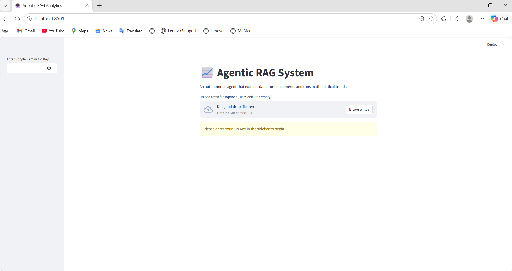
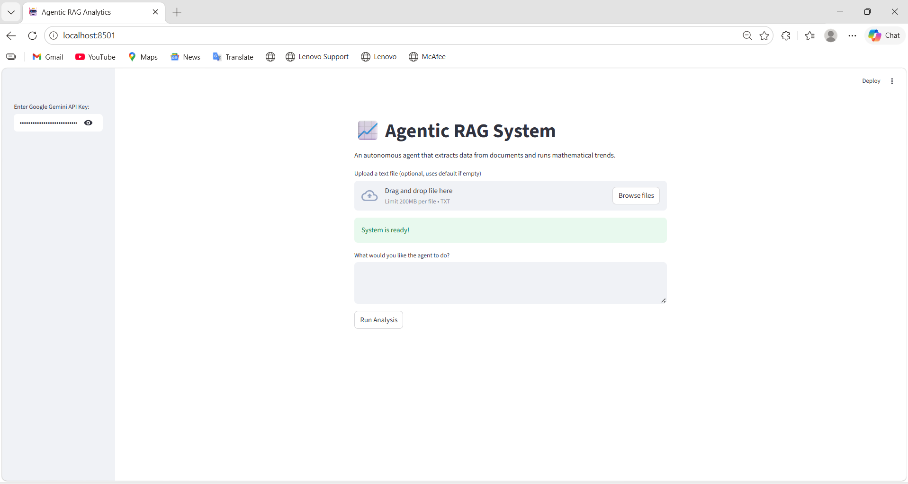
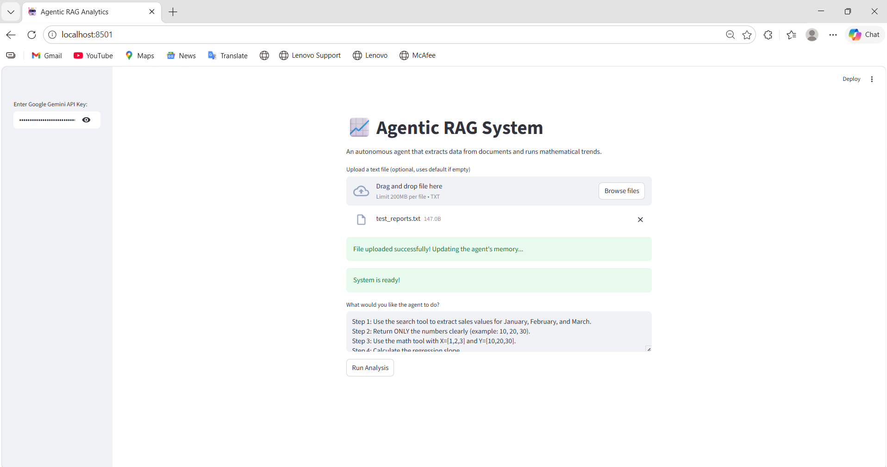

live demo :
https://agentic-rag-system-kscuctfsngsrc7evpqk5bj.streamlit.app/

#  Agentic RAG System

An AI-powered Streamlit application that uses **Retrieval-Augmented Generation (RAG)** and an **Agent-based system** to extract data from documents and perform mathematical trend analysis.

---

##  Features

-  Upload your own `.txt` file
-  Extract relevant data using RAG (FAISS + embeddings)
-  Agent-based reasoning using LangGraph
-  Built-in math tool (Linear Regression Slope)
-  Real-time analysis with Gemini API (BYOK – Bring Your Own Key)

---

##  How It Works

1. User uploads a text file (or uses default data)
2. RAG pipeline retrieves relevant information
3. Agent decides:
   - When to use search tool
   - When to use math tool
4. Final output is generated with reasoning

---

##  Screenshots

### 1. Initial State (Before API Key)


### 2. System Ready


### 3.  File Upload 


### 4. Final Output (Correct Analysis)


##  Tech Stack

- Python
- Streamlit
- LangChain
- LangGraph
- FAISS (Vector Database)
- HuggingFace Embeddings
- Google Gemini API

---

##  Installation & Setup

```bash
git clone https://github.com/Urvah8565/agentic-rag-system
cd agentic-rag-system

pip install -r requirements.txt
streamlit run app.py
```
   
## API Key Setup

> **Important Security Note:**
> - Enter your **Google Gemini API Key** in the sidebar.
> - This project uses **BYOK (Bring Your Own Key)**.
> - No API key is stored in the code (secure approach).
